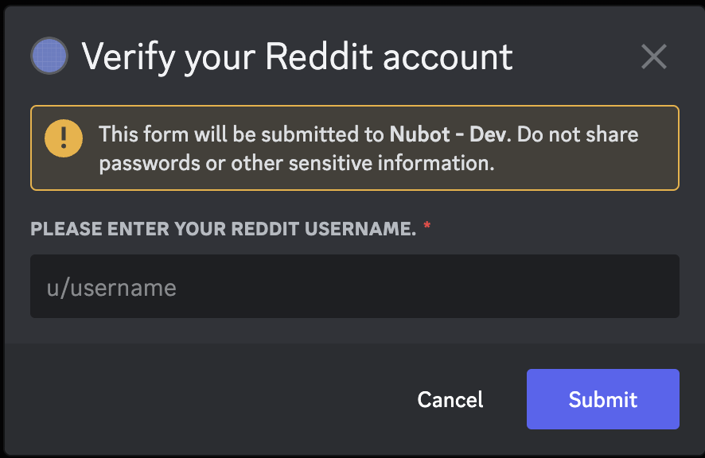
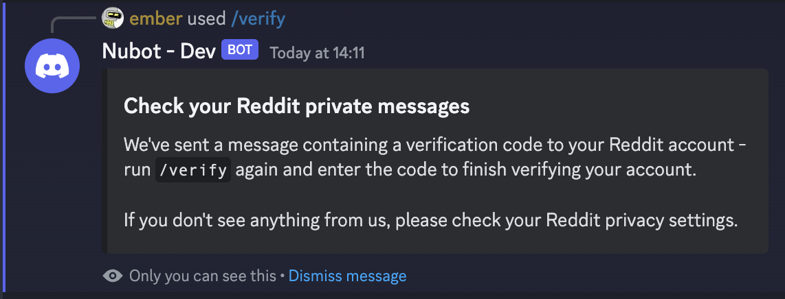
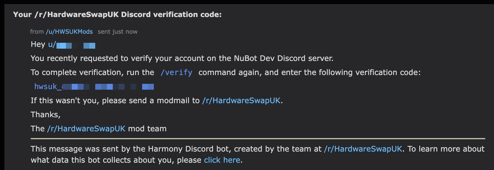
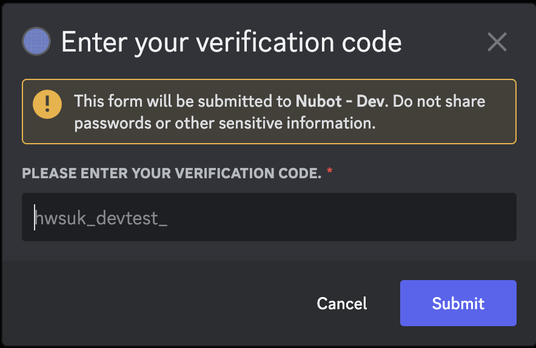
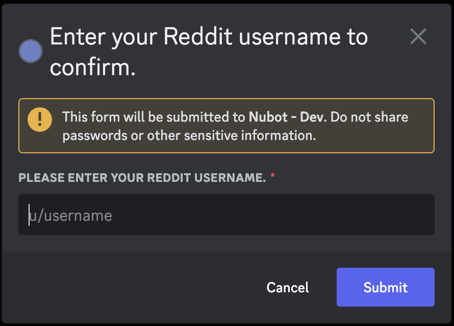
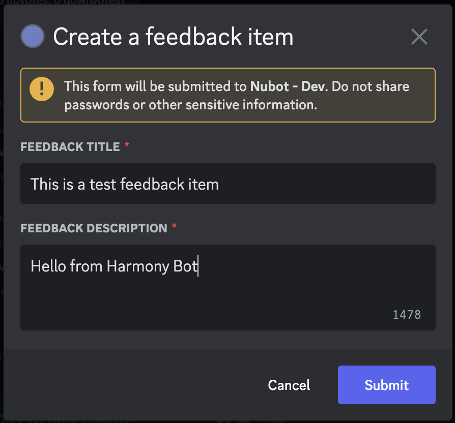
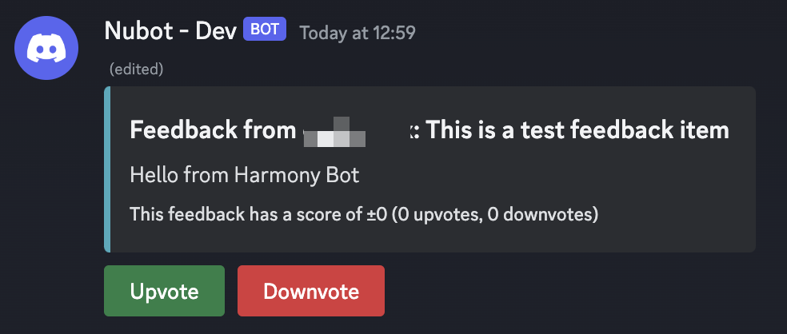
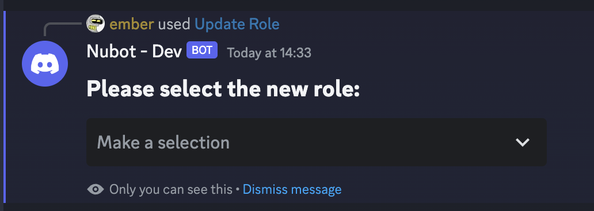

# Harmony User Guide

This guide aims to show you how to use Harmony from a user's perspective. 

> Note that any screenshots, animations or otherwise portrayed in this document are illustrative only, and may not be completely accurate to any production version of Harmony.

## Slash Commands

These commands can be used by typing `/` in any channel which allows the use of slash commands, then clicking on your desired command (or pressing the TAB key on your keyboard) to activate. 

### `/verify`

- **Who can use this:** Any user who has not verified their Reddit account.

Allows a user to link their Reddit and Discord accounts to gain access to sensitive parts of the Discord server.

When `/verify` is run for the first time, a dialogue appears asking you to enter your Reddit username:

Your Reddit and Discord accounts will be checked to ensure they're eligible to join the server, and once this is done, you'll receive a message with next steps, as well as a private message on Reddit containing your verification code:

> If you don't receive any messages on Reddit, please check your privacy settings. If you need another code sending to you, please use the [unverify slash command](#unverify) to cancel your pending verification, and then try again.

Once you've received your verification code, run `/verify` again and enter your code:

Done! You should now have a new role which grants you access to new areas of the server.

### `/unverify`

- **Who can use this:** Any user who has verified their Reddit account, or who has had a verification code sent to them.

Allows a user to unverify their Reddit account, removing their verified role in the process.

If you've already verified your account, then running `/unverify` will prompt you to enter your Reddit username:

If you've had a verification code sent to you, but you haven't yet finished verifying your account, then your old code will be invalidated and you'll be able to run [`/verify`](#verify) from the beginning again.

### `/whois`

- **Who can use this:** Any user.

Allows a user to get information about another member of the Discord server, including the name of their verified Reddit account (if any).

`/whois` takes one argument (the search query), in any of the following formats:

| Query format                                        | Description                                                                  |
|-----------------------------------------------------|------------------------------------------------------------------------------|
| Discord user ID (all numbers)                       | Looks up a user by their Discord user ID.                                    |
| Discord username (any text not beginning with `u/`) | Looks up a user by their Discord username - nicknames are ignored.           |
| Reddit username (any text beginning with `u/`)      | Looks up a user by their Reddit username, if they have linked their account. |

### `/ebay`

- **Who can use this:** Any user.

Allows a user to search recently sold items on eBay to get an idea of how to price any items they wish to sell.

> Note that the results of this function can be influenced by various factors, and is not guaranteed to yield accurate results. Use this only as a guideline.

`/ebay` takes two arguments, the item to search for (required) and the visibility of the results message (optional), and produces results based on the last sold items:

Due to the nature of eBay search, there are normally 60 search results, and these 60 results are used. Sometimes, there may be cases where the results total beyond 60.
Regardless of the number of results, trimming still works to remove 30% of the total results - 15% of the highest and lowest, all to reduce the number of anomalies. 

### `/cex`

- **Who can use this:** Any user.

Allows a user to search items on CeX UK to get an idea of how to price any items they wish to sell.

`/cex` takes one argument, the item to search for, and produces results based on the API's response to your query:

### `/feedback`

- **Who can use this:** Any user.

Allows a user to give feedback for other members of the server to vote on.

## App Commands

These commands can be run by right-clicking on a user or message, and selecting the Apps submenu.

### Whois (app command)

- **Who can use this:** Any user.

Shorthand for the [Whois slash command.](#whois)

### Update Role

- **Who can use this:** Moderators (or anyone with the Harmony Management role ID in the bot's settings).

> Please ensure the integration permissions in your server are set up such that only privileged users can see this command. There is a safeguard in the code to prevent non-management users from using the Update Role command if the integration permissions are not set correctly, but setting the permissions is the only way to completely hide the command for non-management users.

Allows you to assign a predetermined list of roles to a Discord user, and have their Reddit user flair update in turn.

When run for the first time, a menu appears asking you to select a role:

When a role is selected, the bot will update the user's Discord role to the newly selected option, revoking any roles that were previously assigned with the Update Role function as well as updating their Reddit user flair on the configured subreddit:

